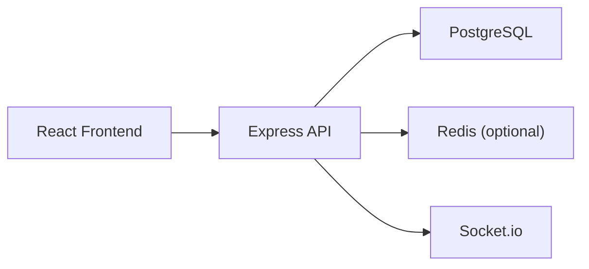

# Enterprise Transport App

A full-stack transport operations platform with authentication, role-based access control, schedule and booking workflows, and realtime updates.

## Project Status
- Viable now for local and LAN evaluation
- Deployment-ready configuration included (`render.yaml`, Docker Compose)
- Last locally verified: March 9, 2026

## Recruiter 5-Minute Evaluation
1. Clone repo
2. Run:
```bash
.\start-all.bat
```
3. Open the printed login URL (typically `http://localhost:5173/login`)
4. Register a user and sign in
5. Confirm API health at `/api/health`

This startup flow auto-handles common local issues (busy ports, service order, env wiring).

## Core Capabilities
- JWT auth: register, login, refresh, logout, password reset
- Permission-based RBAC (`permissions`, `role_permissions`)
- Customer booking lifecycle and cancellation
- Driver assignment workflows
- Realtime status updates with Socket.io
- Input sanitization, rate limiting, request tracing, audit logging

## Architecture
- Frontend: React + Vite + React Router + React Hook Form + Zod
- Backend: Node.js + Express + PostgreSQL
- Realtime: Socket.io
- Cache/Queue: Redis + BullMQ (optional in local mode)
- Infra: Docker Compose + Nginx reverse proxy



## Smart Local Startup (Recommended)
Run one command from project root:

```bash
.\start-all.bat
```

What it does:
- Stops previously tracked app windows
- Picks free backend/frontend ports automatically
- Reuses local Postgres on `5432` if already running, otherwise starts embedded Postgres
- Runs backend migrations + seed, then starts API and frontend
- Writes runtime ports to `.dev-runtime/ports.json`

## Seed Users
`npm run seed` creates/updates these accounts:
- `admin@transport.local`
- `manager@transport.local`
- `driver@transport.local`
- `customer@transport.local`

Default password: `Password@123`

Optional override before seeding:
```bash
set "SEED_DEFAULT_PASSWORD=YourStrongPassword"
```

## Quality Signals
Commands used for quality checks:

```bash
cd backend
npm run lint

cd ../frontend
npm run lint
npm run build
```

Coverage threshold is enforced in `backend/jest.config.js` (>= 80% lines/statements/functions).

## Development Run (Docker)
```bash
docker compose up --build
```
Auto-restart on Windows 11:
- Ensure Docker Desktop is set to start at login.
- Services use `restart: unless-stopped`, so once you run `docker compose up -d --build` one time, they will come back automatically after reboot or Docker restarts.
- If you never want to run commands again, install the startup task once:
```powershell
.\scripts\install-startup-task.ps1
```
To remove it:
```powershell
.\scripts\remove-startup-task.ps1
```

Endpoints:
- App: `http://localhost:5173`
- API: `http://localhost/api`
- Swagger: `http://localhost/api/docs`
- Health: `http://localhost/api/health`

## Production Readiness
Included in repo:
- `render.yaml` service + database definition
- production env templates (`.env.production.example`, `backend/.env.production.example`)
- Nginx reverse proxy config

Required production envs:
- `DATABASE_URL`
- `JWT_SECRET`
- `CORS_ORIGINS`
- `JWT_EXPIRES_IN`, `REFRESH_TOKEN_EXPIRES_IN`
- optional: `REDIS_URL`, SMTP vars

## Production Run
1. Copy templates:
```bash
cp .env.production.example .env.production
cp backend/.env.production.example backend/.env
```
2. Set secure production values
3. Build and run:
```bash
docker compose --env-file .env.production up --build -d
```

## Test Run
```bash
docker compose -f docker-compose.test.yml up --build --abort-on-container-exit
```

## Resume Summary (Copy-Paste)
Built an enterprise transport portal with JWT auth, RBAC, booking and assignment workflows, realtime updates, audit logging, and deployment-ready Docker/Render configuration, including a one-command smart local startup that auto-resolves port conflicts.
